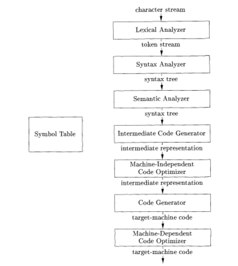

# Notes for Chapter 1 #

## Summary ##

1. Language Processors  
2. Compiler Phases
    * Syntactic Analysis
    * Semantic Analysis
    * Code Generation
3. Machine and Assembly Languages
4. Modeling in Compiler Design
5. Code Optimization
6. High-level languages
7. Compilers and Computer Architecture
8. Software Productivity and Software Security
9. Scope Rules
10. Environments
11. Block Structure
12. Parameter Passing
13. Aliasing

-------------------------------------

### 1.0 - Introduction ###

Programming languages are notations for describing computations to people and to machines.
Before software can run it must be translated into a form which a machine can run.
The software systems that do this translation are called **compilers**.
The study of compiler design touches upon multiple domains: programming 
languages, machine architecture, language theory, algorithms, and software engineering.

### 1.1 - Language Processors ###

A compiler is a program which takes in a program in one language, the *source language*, 
and translates it into another language, the *target language*.
If a compiler is given a source program with errors then it should report them.
An **interpreter** is a special type of language processor.
This program takes in one language and performs the actions described.
The target language for an interpreter is a series of actions.

A machine-targer program is in general faster than if it was executed with an interpreter.
However, an interpreter can usually give better error messages and has faster turn around 
for getting feedback aftr making changes to the source program.

The Java language processors consist of two parts: a compiler, and interpreter called the
virtual machine.
The compiler takes the source language and translates it to byte code while the virtual 
machines takes the byte code and runs it.
In addition to interpretering the virtual machine can also compile parts of the code to machine
code for performance boosts.
This is called *just in time* compiling.

Exercises for 1.1

1. What is the difference between a compiler and interpreter?

>
>   A compiler takes in a program, in its source language, and outputs the program 
>   in a new language, called the target language.
>   A compiler does not have to understand what the words mean.  It only need to
>   know how to translate it to the target langauge while keeping the semantics 
>   the same.
>
>
>   An interpreter takes in a source program, along with any neccessary input, and executes it.
>   An interpreter has to understand how to perform operations, such as addition.
>

2. What are the advantages of:
    1. A compiler over an interpreter? 
    2. An interpreter over a compiler?

>
>   A.  A compiler can translate the program to machine-language which can be, if properly
>       done, much faster than an interpreter.  In addition, the resource usage should be
>       smaller.
>
>   B.  An interpreter can provide better information for when errors occur.  In addition,
>       if a modification to the source program occurs the user can simply restarting 
>       execution of the program.  Additionally, it is much easier to provide a way to 
>       modify the source program during execution as well.  Interpreters usually provide  
>       garbage collection so resource management is more forgiving. 
>

3. What advantages are there to a language-processing system in which the compiler produces 
    assembly language rather than machine languages?

>
>   As long as an assembler exists for the assembly language we target on a machine we can
>   write programs for that machine.  Therefore, if the assembly language is popular then
>   our compiler is supported on multiple machines without us having to write our own assemblers
>   for each machine.
>

4. A compiler the translates a high-level language into another  high-level language is called a
    *source-to-source* translator.  What advantages are there to using C as a target language for
    a compiler?

    
>
>   C compilers exists for nearly all architectures.  In addition, C has been around for over 50
>   years and therefore C compilers are highly optimized.  This takes the complex optimization  
>   problems that you would have had to solve, and gives them to 50 years of optimizations.
>

5. Describe some of the tasks that an assember needs to perform.

>
>   The main job of an assembler is to take assembly code and convert it into its binary equivalnce
>   in machine code for the target machine.
>   It needs to be able to write the code in a format which the local operating system can load 
>   for execution.  It also converts the labels for jump instructions into their correct address.
>   Some assembly languages allow for macro functions, therefor those assemblers need to expand
>   those macros.
>

-------------------------------------

### 1.2  - The Structure of a Compiler ###

Inside of a compiler there are two parts: analysis and synthesis.
The analysis part breaks up the source program into constitent pieces and imposes a grammatical 
structure on them.
It then uses this structure to generate an *intermediate representation* of the source program.
If during analysis this structure is found to either be syntactically or semantically incorrect,
then a message must be presented to the programmer. 
During analysis information is also gathered and stored in what is called the **symbol table**, 
which along with the intermediate representation is passed to the synthesis part.

The synthesis portion of the compiler constructs the target program using the symbol table and 
intermediate representation.  
The analysis portion is usually called the frontend, while the synthesis portion is called the 
backend.

The compilation process is broken into *phases*, each which transforms one representation of the
source program to another.
Some phases are joined together in practice, such as the *lexical* and *syntax analyzers*.
Along with the new intermediate representation, the symbol table is passed along to the next
phase.
Some of the phases can be optimization phases which allows for better target programs to be 
generated.
Some optimizations are: efficient target programs, faster target programs, and smaller target
programs.

#### 1.2.1 - Lexical Analysis ####

The first phase of compilation is the lexical phase in which the source program is read in and 
tokenized.  The output is a stream of tokens, called lexemes, of the form:

>
> <token-name,attribute-value>
>

The *token-name* is an abstract symbol used during syntax analysis.
The *attribute-value* points to an entry in the symbol table for this token.
The symbol table here would hold information related to the name, type, and raw value of the
lexeme.

Here is an example

>
>   position = initial + rate * 60
>

1. *position* is a lexeme that would be mapped to token `<id,1>`, where id the an abstract symbol 
    standing for *identifier*.  The numeric value 1 points to an entry in the symbol table for 
    position.
2. The assignment symbol *=* is a lexeme mapped to the token `<=>`, with the attribute-value 
    removed.  
3. *intial* is a lexeme that is mapped into the token `<id,2>`
4. *+* is mapped to `<+>`
5. *rate* is a lexeme mapped to `<id,3>`
6. *\** is mapped to to `<*>`
7.  *60* is a lexeme mapped to `<60>`

The final representation is

>
>   `<id,1>` `<=>` `<id,2>` `<+>` `<id,3>` `<*>` `<60>`
>

The full translation from the source program to a assembly program.  

#### 1.2.2  - Syntax Analysis ####

Given tokens, we need to perform *syntactic analysis* on them, also called *parsing*.
In this phase we take in a stream of tokens and create a new intermediate representation, usually what
is called a *syntax tree*, or *parse tree*.
This tree represents the syntactic structure of the source program, or token stream.
The typical representation is that interior nodes are operations, while leaves are values and identifiers.

#### 1.2.3  - Semantic Analysis ####

The semantic analyzer uses the syntax tree to symbol table to verify that the semantics of the 
source program are correct.
One important verification is called *type checking* which verifies that for an operation all the values 
used are of the correct type.
For example, with array indexing the parameter is required to be an integral value rather than a float.
Another example is the modulus operator, it requires that the values be integral as well.

In the language some type of conversions are possible, called *coercions*.
For example during multiplication one parameter is an integral value, while the other a floating point value.
The language allows for the integral value to be promoted to a floating point representation for this operation.
The type checker will add an extra node between the operator and value which signifies that it should be 
promoted or demoted as needed.

#### 1.2.4  - Intermediate Code Generation ####

    

        Something funky
    

    
This is a test.

#### 1.2.5  - Code Optimization ####

#### 1.2.6  - Code Generation ####

#### 1.2.7  - Symbol-Table Management ####

#### 1.2.8  - The Grouping of Phases into Passes  ####

#### 1.2.9  - Compiler Construction Tools ####

### 1.3  - The Evolution of Programming Languages ###

